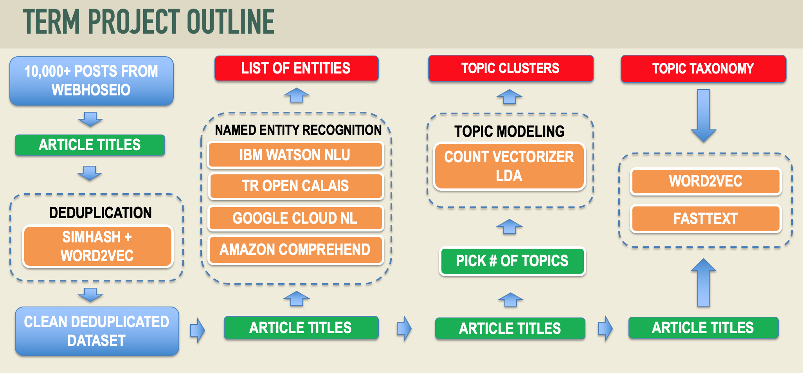

## ANLY 540 NLP Project Requirements

Whatever you have in your notebook, for clean the entities, topic extraction and then modeling using word2vec, like taxonomy, that’s your project goal, with output, like presenting..

PPT should contain snapshots of your output, make excel spreadsheets, tables, anything to bring your points across. The idea is to show what are the important entities, topics, and how do you use your topics to construct your topic taxonomy for doing semantic similarity.

1. Using number/frequency of entity to show the importance
2. See how many entities are relevant to Apple for example
3. Verbs take priority, associated with actions, topics are usually associates with actions
4. You can use verbs along with nouns, do testing, design taxonomy, validate your model, see how articles classified, rerun and see results. Fairly well to classify articles to your taxonomy. Like doing LDA but manually doing taxonomy.
5. Word2vec(2013) model had hard time associating dreamline with correct subject,(out dated) then in that case use fasttext(2017).(search https://fasttext.cc/docs/en/english-vectors.html)
6. Or use genism library, you can try different languages in fasttext
7. Category – subcategory - taxonomy topic(keyword) – calculate score – assignment 11 Qs.

